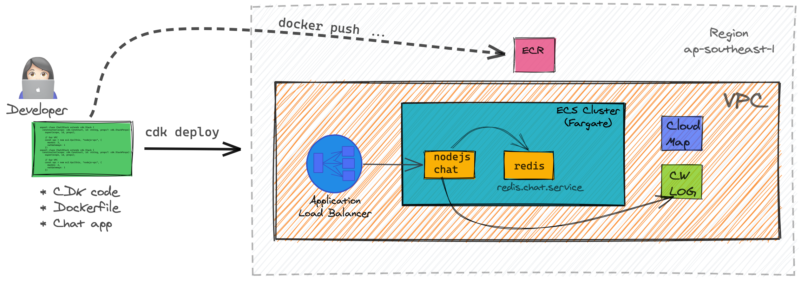

## Architecture:



Current CDK script uses a dockerize Redis running on Fargate, it is not durable or HA.
Challenge: Change this CDK code to adopt Amazon ElastiCache!


### get nodejs
```bash

nvm install 8.12.0 

nvm alias default v8.12.0
```

### install node modules
```bash
npm install
```

### show the aw resources that cdk will create

```bash
npx cdk diff
```

### make sure your aws cli is setup (eg: aws cloudformation), deploy the aws resources
```bash

npx cdk deploy --require-approval never

```


### remove all resources:
```bash
npx cdk destroy
```
